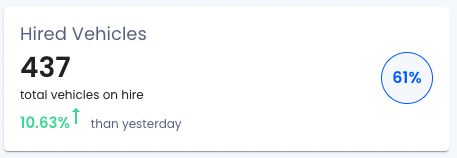

# Card Component



This card component is designed to represent data in multiple diffrent ways.

## Usage

Following is an example, how you can impelement this component.

```js
...
<Card
    primary="Vehicles Off Road"
    secondary="total vehicles off road"
    compareText="than yesterday"
    primaryCount={data.total_count - data.hired_count}
    percentage={Math.round(
    ((data.total_count - data.hired_count) / data.total_count) * 100
    )}
    comparePercentage={Math.abs(comparison.toFixed(2))}
    compareState={comparison < 0 ? false : true}
/>
...
```

### API

The component accepts the following props.
| Name | Type | Default | Description |
|--|--|--|--|
|**`primary`**|string ||Main Card heading|
|**`secondary`**|string||Secondary Text, shown underneath the data count.|
|**`compareText`**|string|false|If sent empty, does not show anything. Ref to show change in numbers.|
|**`primaryCount`**|integer/string||Main count/number|
|**`percentage`**|integer/float/string||Shows up in circular Comp.|
|**`comparePercentage`**|number||Shows up in rise or decline|
|**`compareState`**|boolean|false|**`false`** means green/good.<br/>**`true`** means red/bad.

> **Developed and Compiled:** Hamza Fayyaz (Hayan Systems)
